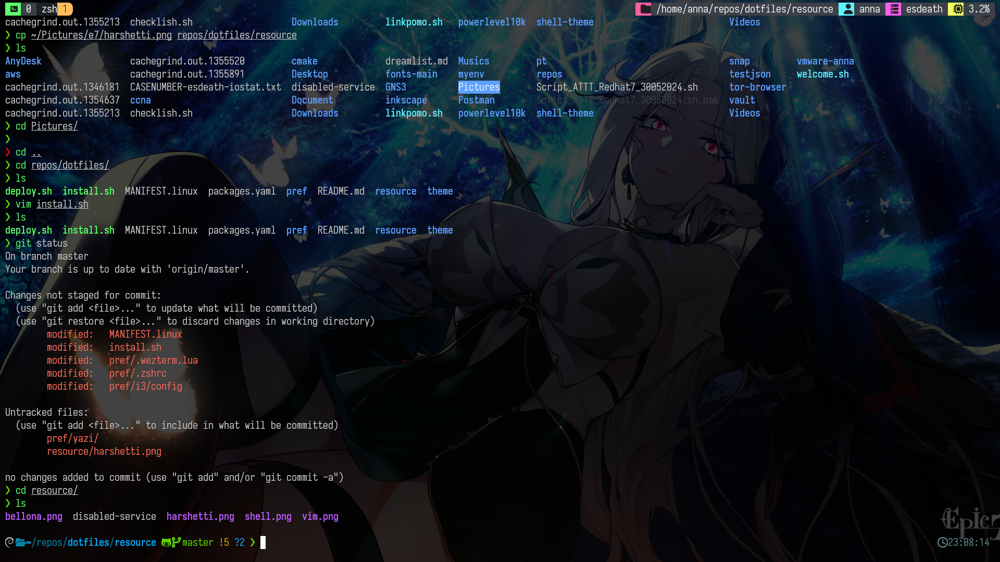

- To load icon, u need to install a nerd fonts, refer [there](https://www.nerdfonts.com/font-downloads). My config auto download Iosevka nerd fonts.
- Read those documents below and install yourself.

## General tweak

- [powerlevel10k](https://github.com/romkatv/powerlevel10k.git)
- [oh-my-zsh](https://github.com/ohmyzsh/ohmyzsh.git)
- [wezterm](https://wezfurlong.org/wezterm/installation.html)
- [Starship](https://github.com/starship/starship.git)
- [tmux plugin manager](https://github.com/tmux-plugins/tpm.git)
- [alacritty](https://github.com/alacritty/alacritty/blob/master/INSTALL.md)
- [bun](https://github.com/oven-sh/bun)
- [catppuccin](https://github.com/catppuccin/bat/tree/d714cc1d358ea51bfc02550dabab693f70cccea0)
- [nerd font](https://www.nerdfonts.com/font-downloads)

### Plugin for zsh

- [hacker-quotes](https://github.com/oldratlee/hacker-quotes?tab=readme-ov-file)
- [zsh-syntax-highlighting](https://github.com/zsh-users/zsh-syntax-highlighting/blob/master/INSTALL.md)
- [zoxide](https://github.com/ajeetdsouza/zoxide)
- [fzf](https://github.com/junegunn/fzf?tab=readme-ov-file#setting-up-shell-integration)
- [awesome-zsh-plugins](https://github.com/unixorn/awesome-zsh-plugins?tab=readme-ov-file#ansible-role-zsh)

### Preview

